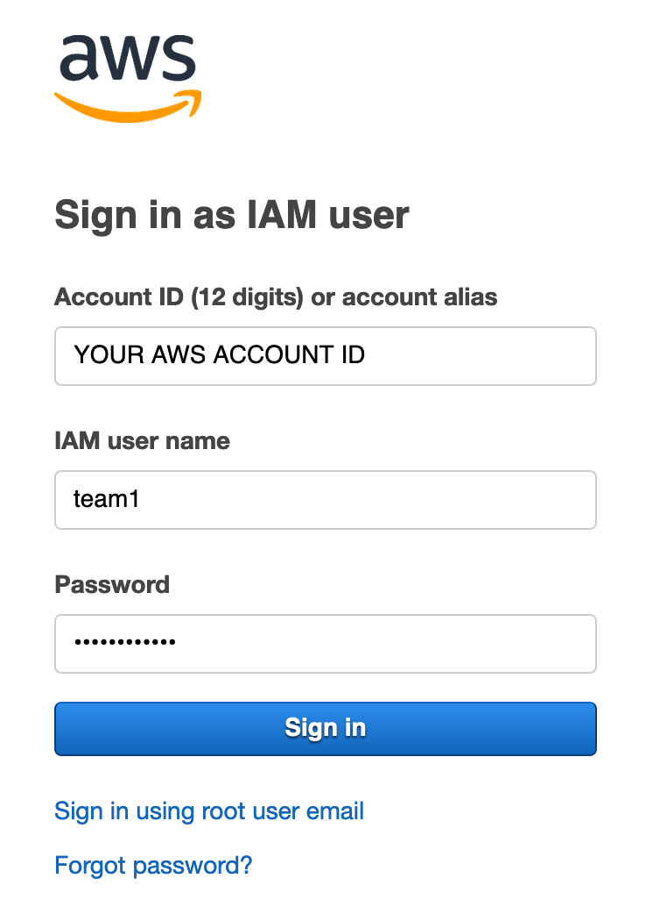

# Introduction

Here you will find the steps necessary to launch the infrastructure provided during the Dojo in your own AWS account.

# Pre-Requisites

## Configuring AWS Keys

In order to launch the infrastructure, you will need an Access Key and a Secret Access Key with access to CloudFormation, EC2 and Secrets Manager in your AWS account. If you are not sure how to configure the access key and the secret access key locally in your machine, [follow this guide](https://docs.aws.amazon.com/cli/latest/userguide/cli-configure-files.html).

## Beware of Open Access to Fabio

In the ClouFormation template, you will find that the security group for the Nomad client opens ports 9999 and 9998 to 0.0.0.0/0. Feel free to modify that to your own IP address so that only you can access the Load Balancer (Fabio).

## Region and Availability Zone

The CloudFormation template only works with a few regions (you can find the list of supported regions in the `Mappings` section of the code). To make the template simpler, the subnet created will always be in the availability zone `a` of the chosen region. Feel free to add more regions and change the availability zone.

# Launching the Infrastructure

Once you've configured the AWS keys, run the following in your terminal:

```bash
./launch-dojo-infrastructure.sh
```

The script above should output the CloudFormation stack ID as well as the password for the IAM User created by the CloudFormation template:

```bash
{
    "StackId": "arn:aws:cloudformation:{REGION}:{AccountId}:stack/team1/{StackId}"
}
AWS Password for the "team1" user: team1-xxxxxx
```

# Accessing the Environment

To access the Cloud9 environment, log out from your AWS account and log in using the following info:



PS: You can find the password in the terminal after running the `launch-dojo-infrastructure.sh` script, or in AWS Secrets Manager in your account.

You will notice that the CloudFormation template currently configures the IAM User it creates (i.e., `team1`) to be the owner of the Cloud9 environment, which means that you will need to **log in to your AWS account as that user as mentioned above**. If you want another IAM User or an IAM Role to have access to the environment instead, you will need to modify the `OwnerArn` in the template (line 188) and update the stack:

```yaml
Cloud9Environment:
    Type: AWS::Cloud9::EnvironmentEC2
    Properties: 
        AutomaticStopTimeMinutes: 20160
        Description: !Sub ${Namespace} Cloud9 environment
        InstanceType: t2.medium
        Name: !Sub ${Namespace}-environment
        OwnerArn: !GetAtt TeamUser.Arn <--- SPECIFY ANOTHER ARN (User, Role etc)
        SubnetId: !Ref Subnet
```

# Destroying the Infrastructure

Destroying the infrastructure is very easy. Simply run:

```bash
./destroy-dojo-infrastructure.sh
```

# Who to contact in case of issues?

[Please reach out to me on LinkedIn](https://www.linkedin.com/in/renansdias) if you have any issues with these scripts. And feel free to modify any of the scripts and the CloudFormation template to your liking.
